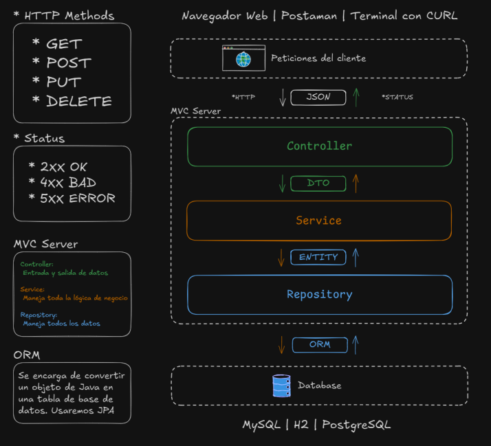

# Clase 13 | Operaciones CRUD con Base de Datos

---

## Índice

- Clase 13 | Operaciones CRUD con Base de Datos
- Creación de interfaces Repository.
- Implementación de operaciones CRUD utilizando JPA Repository.
- Inyección de dependencias (@Autowired).
- Refactorización de controladores y servicios para usar la base de datos.
- Pruebas de funcionalidad con datos reales.
- Clase 14 | Integración del Backend con el Frontend
    - Configuración de CORS para permitir la comunicación con el frontend.
    - Consumo de la API desde el frontend existente.
    - Pruebas integrales del sistema completo.
    - Resolución de problemas comunes en la integración.

---

## Objetivos de la Clase

### Crear interfaces Repository
Para acceder a la base de datos usando Spring Data JPA.

### Implementar operaciones CRUD
Directamente en la base de datos.

### Inyectar dependencias
Repositorios en servicios y servicios en controladores.

### Refactorizar el código
Sustituir lista en memoria por consultas a la base de datos.

---

## @Repository

### Interfaz @Repository

#### Repaso sobre: ¿Qué es una Interfaz?

Una interfaz define un contrato que especifica qué métodos debe implementar una clase. No contiene código propio, solo declaraciones de métodos. En Java, las interfaces se declaran con la palabra clave `interface`.

### Interfaz @Repository

La anotación `@Repository` en Java se utiliza para indicar que una clase implementa una interfaz de repositorio y está diseñada para interactuar con una base de datos.

#### Características de la anotación @Repository

La anotación `@Repository` actúa como un componente de Spring que permite aprovechar las funcionalidades de gestión de transacciones y excepciones de Spring Data JPA. Su uso principal es para simplificar el acceso a la base de datos, proporcionando un método sencillo y consistente para realizar operaciones CRUD (Crear, Leer, Actualizar y Eliminar).

---

## Creación de Interfaces Repository

```java
@Repository
public interface ProductoRepository extends JpaRepository<Producto, Long> {
    // Métodos personalizados aquí si son necesarios
}
```

Spring Data JPA permite definir interfaces que extienden JpaRepository para acceder a datos sin escribir SQL manualmente.

---

## Operaciones CRUD con @Repository

CRUD representa las cuatro operaciones fundamentales:

- **Create (Crear):** `save()` o `create()`
- **Read (Leer):** `findAll()`, `findById()`
- **Update (Actualizar):** `save()`
- **Delete (Eliminar):** `delete()` o `deleteById()`

### Ventajas
- Implementación automática de operaciones CRUD básicas
- Gestión de transacciones incorporada
- Manejo de excepciones específicas
- Métodos predefinidos
- Capacidad de crear consultas personalizadas

---

## Implementación de Operaciones CRUD con la Interfaz @Repository

### findAll()
Lista todos los productos.

### findById(ID)
Busca un producto por su ID.

### save(Entity)
Guarda o actualiza un producto.

### deleteById(ID)
Elimina un producto por su ID.

---

## ProductoService Refactorizado

```java
@Service
public class ProductoService {
    private final ProductoRepository repo;

    @Autowired
    public ProductoService(ProductoRepository repo) {
        this.repo = repo;
    }

    // Métodos CRUD aquí
}
```

---

## Métodos CRUD en ProductoService

### listarTodos()
```java
public List<Producto> listarTodos() {
    return repo.findAll();
}
```

### obtenerPorId()
```java
public Producto obtenerPorId(int id) {
    return repo.findById(id).orElse(null);
}
```

### guardar()
```java
public Producto guardar(Producto p) {
    return repo.save(p);
}
```

### actualizar()
```java
public Producto actualizar(int id, Producto datos) {
    Producto p = obtenerPorId(id);
    if (p != null) {
        p.setNombre(datos.getNombre());
        p.setPrecio(datos.getPrecio());
        p.setCantidadEnStock(datos.getCantidadEnStock());
        return repo.save(p);
    }
    return null;
}
```

### eliminar()
```java
public boolean eliminar(int id) {
    if (repo.existsById(id)) {
        repo.deleteById(id);
        return true;
    }
    return false;
}
```

---

## Inyección de Dependencias

### Concepto
La inyección de dependencias separa la creación de objetos de su uso.

### Ejemplo Práctico
```java
public class ProductoService {

    private final ProductoRepository repo;

    public ProductoService(ProductoRepository repo) {
        this.repo = repo;
    }
}
```

### Con @Autowired
```java
@Service
public class ProductoService {

    @Autowired
    private final ProductoRepository repo;

    // ... métodos del servicio
}
```

---

## ProductoController Refactorizado

```java
@RestController
@RequestMapping("/productos")
public class ProductoController {
    private final ProductoService productoService;

    @Autowired
    public ProductoController(ProductoService productoService) {
        this.productoService = productoService;
    }

    // Métodos del controlador aquí
}
```

---

## Testeando el código

### 1) Crear un producto
```java
@PostMapping
public ResponseEntity crearProducto(@RequestBody Producto producto) {
    return ResponseEntity.ok(productoService.guardar(producto));
}
```

### 2) Listar todos los productos
```java
@GetMapping
public ResponseEntity<List<Producto>> listarTodos() {
    return ResponseEntity.ok(productoService.listarTodos());
}
```

### 3) Actualizar un producto
```java
@PutMapping("/{id}")
public ResponseEntity actualizar(@PathVariable Long id, @RequestBody Producto producto) {
    return ResponseEntity.ok(productoService.actualizar(id, producto));
}
```

### 4) Eliminar un producto
```java
@DeleteMapping("/{id}")
public ResponseEntity eliminar(@PathVariable Long id) {
    productoService.eliminar(id);
    return ResponseEntity.noContent().build();
}
```

---

## Verificación con Postman / MySQL Workbench

### Postman
- **GET** http://localhost:8080/productos
- **POST** http://localhost:8080/productos
- **PUT** http://localhost:8080/productos/1
- **DELETE** http://localhost:8080/productos/1

### MySQL Workbench
Verifica los registros creados, actualizados o eliminados con:
```sql
SELECT * FROM producto;
```

---

## Diagrama en Clase



---

## Ejercicio Práctico Obligatorio

### Situación
Sibelius, el cliente gourmet, requiere agregar más información de los productos (descripción, categoría, etc.). Silvia (Product Owner) quiere poder filtrar productos según nombre o categoría.

### Tareas
1. Agregar nuevos atributos a la entidad Producto (por ejemplo, `descripcion`, `categoria`).
2. Verificar que se agreguen las columnas al iniciar la app.
3. Crear varios productos y listarlos.

---

## Recursos
- [Documentación de Spring Data JPA](https://spring.io/projects/spring-data-jpa)
- [Documentación de MySQL](https://dev.mysql.com/doc/)
- Tutoriales sobre integración Spring Boot + MySQL

---

## Preguntas para Reflexionar
1. ¿De qué forma el uso de repositorios JPA simplifica las operaciones CRUD?
2. ¿Cómo influye la persistencia en la base de datos en la escalabilidad y confiabilidad del sistema?

## Swagger

### Exportar documentación OpenAPI

Swagger genera también un archivo JSON/YAML con toda la descripción de tu API.
Podés accederlo en:

👉 http://localhost:9090/v3/api-docs

👉 http://localhost:9090/v3/api-docs.yaml

### Acceder a Swagger UI

Una vez levantada la app, abrí en el navegador:

👉 http://localhost:9090/swagger-ui.html

o (según configuración):

👉 http://localhost:9090/swagger-ui/index.html